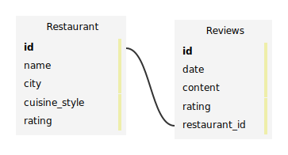

# WWW-SQL-Designer-to-SVG 🚀

Welcome to the WWW-SQL-Designer-to-SVG repository – a JavaScript tool for effortless SVG exports of database schemas designed using [WWW-SQL-Designer](https://sql.toad.cz) by [Ondrej Zara](https://github.com/ondras).

[Example ouput from default:](https://sql.toad.cz/?keyword=default)


## Features

- **Tiny output**: Generated SVG is essentially already minified
  
- **Retain Notes**: Notes are included in output and are shown on hover.

- **AutoCrop**: Auto zooms to display full diagram.

- **Simple Export**: Export your database diagrams to SVG with a single click.

- **Lightweight Bookmarklet**: A bookmarklet under 2KB for seamless integration into your browser.

## How to Use

1. Visit [sql.toad.cz](https://sql.toad.cz) and create your database schema.

2. Click the "WWW-SQL-Designer-to-SVG" bookmarklet in your bookmarks bar.

3. Your database diagram in SVG will open in a new tab, save using ctrl + s; ready for sharing or documentation.

## Installation

1. Create a new bookmark in your browser.

2. Copy and paste the following code into the bookmark URL/Location field:
   ```javascript
   javascript:((a=document,b="http://www.w3.org/2000/svg",c="style",d="rect",e="slice",h="fill",f="width",j="height",i="left",k="querySelector",l="querySelectorAll",m="forEach",n="title",o="innerHTML",g="cloneNode",p="removeAttribute",q="createElement")=>{var r=a=>+(+a).toFixed(1),s=c=>a[q+"NS"](b,c),u=(a,b,c,d)=>a.setAttribute(b,d?r(c):c),w=(a,b)=>a["offset"+b[0].toUpperCase()+b[e](1)],x=(a,b)=>a.append(b),t=a[k]("#area>svg")[g](1),v=s(c);u(t,"xmlns",b),u(t,"font-family","verdana, sans-serif"),u(t,"font-size","12"),v[o]="text{cursor:default}.b{font-weight:bold}g>rect:first-child{fill:#f4f4f4}",t.prepend(v),a[l]("#area>.table")[m](a=>{var b=s("g"),g=s(d),q=w(a,i),y=w(a,"top"),z=w(a,f);u(g,"x",q,1),u(g,"y",y,1),u(g,f,z,1),u(g,j,w(a,j),1),x(b,g),[...a[l]("tr")][m]((a,g)=>{var l=s("g"),m=s("text"),t=a.innerText.trim(),v=s(d),r=s(d),A=w(a,"top"),B=w(a,j);u(v,"x",q+z-10,1),u(v,"y",y+A,1),u(v,f,4),u(v,j,B,1),u(r,f,8),u(r,j,8),u(r,h,"#7db2dd"),a[k](".primary,.key")&&m.classList.add("b"),m[o]=t,x(l,m),x(b,l);var C;if(0===g)C=a[k]("td")[n],C&&(u(r,"x",q+z-8,1),u(r,"y",y+A,1)),u(m,"x",q+z/2-+(6.2*t.length)/2,1),u(m,"y",y+A+18,1);else{var D=a.parentElement,p=D[c].borderColor[e](4,-1).split(", ").map(a=>(a?+a:"").toString(16)).join("");C=D[n],p&&(u(v,h,"#"+p),x(l,v)),C&&(u(r,"x",q+z-16,1),u(r,"y",y+A+(B-8)/2,1)),u(m,"x",q+w(a,i)+10,1),u(m,"y",y+A+15,1)}if(C){var E=s(n);E[o]=C,x(l,r),x(l,E)}}),x(t,b)});var y=a[q]("iframe");u(y,c,"position:fixed;opacity:0;width:0px;height:0px;overflow:hidden;inset:0;border:0"),x(a.body,y),padding=20;var z=y.contentWindow.document;x(z.body,t[g](1));var A=z[k]("svg").getBBox();A&&(t[p](f),t[p](j),u(t,"viewBox",[A.x-padding,A.y-padding,A[f]+2*padding,A[j]+2*padding].join(" "))),y.remove();var B=URL.createObjectURL(new Blob([t.outerHTML],{type:"image/svg+xml"}));window.open(B)})();
